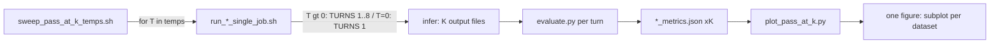

# Session system prompt

1. Read this entire `Project_plan.md` before doing any work.
2. Work on **exactly one** subtask: the first todo with `status: pending`, or the id the user names.
3. **Active subtask right now:** none (Goal S1–S3 complete)
4. Do not reopen Locked decisions unless the user explicitly asks.
5. Stay inside the active subtask’s deep brief. Put blockers and follow-ups in the Progress log.
6. Before editing, open the files named in that subtask’s deep brief and understand the current call graph.
7. Before ending the chat: mark the subtask completed or blocked; append a Progress log entry; end with `subtask_id | done|blocked | next_pending_id`.
8. Do not create alternate plan files (`Project_plan_v2.md`, dated copies, chat-named plans). This file is authoritative.

# Goal

Enable Pass@8 exploration curves (Pass@8 Rate vs Temperature) with minimal changes to the existing math_4qa HF eval pipeline: a temperature-sweep wrapper around the current single-job scripts, plus a post-hoc aggregator/plotter that ORs per-sample correctness across turn metric files and draws one subplot per dataset with legends for model×prompt runs.

# Architecture / codebase map

Key paths:
- [`evaluation/run_7B_math_4qa_hf_single_job.sh`](evaluation/run_7B_math_4qa_hf_single_job.sh) / [`run_3B_math_4qa_hf_single_job.sh`](evaluation/run_3B_math_4qa_hf_single_job.sh) — drivers; `TURNS`/`TEMPERATURE`/`PROMPT_TYPE` env-overridable
- [`evaluation/run_layout.sh`](evaluation/run_layout.sh) — writes `run_config.yaml` (temperature, prompt_type, training_experiment)
- [`evaluation/src/inference_engine.py`](evaluation/src/inference_engine.py) — one independent rollout file per turn
- [`evaluation/sweep_pass_at_k_temps.sh`](evaluation/sweep_pass_at_k_temps.sh) — temperature loop
- [`evaluation/plot_pass_at_k.py`](evaluation/plot_pass_at_k.py) — Pass@8 OR + plot

# Subtasks

## S1 — Env-overridable knobs
- Goal: wrapper can set TURNS/TEMPERATURE/PROMPT_TYPE without editing drivers.
- Done when: `${VAR:-default}` used; unset env keeps prior defaults.

## S2 — Temperature sweep wrapper
- Goal: loop default temps `0.0 0.2 0.4 0.6 0.8 1.0`; T=0 → TURNS=1 else full TURNS.
- Files: new `evaluation/sweep_pass_at_k_temps.sh`.

## S3 — Post-hoc Pass@8 + plot
- Goal: glob available turn metrics; OR correctness; subplot per dataset; legend = training_experiment + prompt_type.
- Files: new `evaluation/plot_pass_at_k.py`.

# Locked decisions
- Pass@8 = OR across available turn files (K=8 sampling; K=1 at T=0).
- Default temps: `0.0 0.2 0.4 0.6 0.8 1.0`.
- T=0 → TURNS=1; no reverse-order loop for savings.
- Collection = wrapper + existing job; aggregation/plot post hoc only.
- Legend = training_experiment + prompt_type.
- Metric key: prefer `llm_equal`, fallback `math_equal`.

# Progress log

### 2026-07-21 — S1-env-overrides — completed
- Changes: `PROMPT_TYPE`/`TURNS`/`TEMPERATURE` use `${VAR:-default}` in 7B and 3B single-job scripts.
- Follow-ups: none.
- Next: S2-temp-sweep-wrapper

### 2026-07-21 — S2-temp-sweep-wrapper — completed
- Changes: added `evaluation/sweep_pass_at_k_temps.sh` (temps `0.0 0.2 … 1.0`; T=0 → TURNS=1).
- Follow-ups: none.
- Next: S3-posthoc-plot

### 2026-07-21 — S3-posthoc-plot — completed
- Changes: added `evaluation/plot_pass_at_k.py` (OR across discovered turn metrics; subplot per dataset; legend=`experiment+prompt`). Smoke-tested on existing `outputs/hf_math_4qa` runs.
- Follow-ups: run real temp sweeps via wrapper when ready; smoke PNG/JSON under `evaluation/outputs/pass_at_k_*_smoke.*` are optional artifacts.
- Next: none
