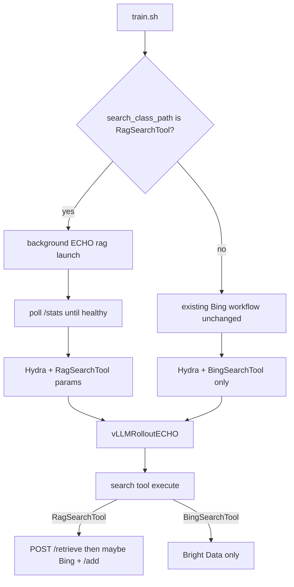

# Session system prompt

1. Read this entire `Project_plan.md` before doing any work.
2. Work on **exactly one** subtask: the first todo with `status: pending`, or the id the user names.
3. **Active subtask right now:** `S4-readme-rag`
4. Do not reopen Locked decisions unless the user explicitly asks.
5. Stay inside the active subtask’s deep brief. Put blockers and follow-ups in the Progress log.
6. Before editing, open the files named in that subtask’s deep brief and understand the current call graph.
7. Before ending the chat: mark the subtask completed or blocked; append a Progress log entry; end with `subtask_id | done|blocked | next_pending_id`.
8. Do not create alternate plan files (`Project_plan_v2.md`, dated copies, chat-named plans). This file is authoritative.

# Goal

Augment ECHO training search with a RagSearchTool that treats the unioned Bright Data search caches under `ECHO/search_cache/` as a semantic corpus (E5 + FAISS), looks up similar past queries before calling Brightdata Bing, and online-updates the RAG index when Bing fallback returns new results. Keep plain `BingSearchTool` as a separate Hydra-selectable option. Own the RAG sidecar + launcher under **ECHO** (Tree-GRPO / old ARPO rag scratch as design reference only). `train.sh` starts/waits for that sidecar only when `RagSearchTool` is configured. Operator installs RAG deps manually. Retire old `ARPO/rag_search_*` in a final cleanup subtask after the new path is tested.

# Architecture / codebase map



| Path | Role |
|------|------|
| `ECHO/training/main_echo.py` | Hydra training entry |
| `ECHO/training/scripts/train.sh` | YAML → Hydra; **conditional ECHO RAG sidecar lifecycle** |
| `ECHO/training/config/echo_trainer.yaml` | Tool instances / masks |
| `ECHO/training/training_config/echo_3B_ll_hl_rag.yaml` | RAG experiment launch knobs |
| `ECHO/search_cache/*.json` | Flat `dict[str,str]` query → `Page N: ...` caches |
| `ECHO/training/merge_search_cache_postrun.py` | Sentinel-aware merge (untouched for RAG union) |
| `ECHO/training/build_rag_corpus_union.py` | **S1** naive union → `search_cache_union_rag.json` |
| `ECHO/training/rag/` (new) | **S2** ECHO-owned FastAPI FAISS sidecar (`/retrieve`, `/add`, `/stats`) |
| `ECHO/training/scripts/rag_launch.sh` (new) | **S2** Sidecar launcher (default corpus = union JSON, port 5003) |
| `ARPO/verl_arpo_entropy/.../search_tool.py` | `BingSearchTool`; rename `BingSearchToolRAG` → `RagSearchTool` |
| `ARPO/verl_arpo_entropy/.../vllm_rollout_echo.py` | `<search>` → execute → `<result>` (unchanged) |
| `ARPO/rag_search_server.py`, `ARPO/rag_search_launch.sh` | **Reference only** — prior chat scratch; do not wire `train.sh` to them; retire in **S5** |
| `Tree-GRPO/search_r1/search/retrieval_server.py` | Design reference (API shape / Encoder patterns) |
| `README.md` | Root runbook (S4) |

Plug point: Hydra `actor_rollout_ref.rollout.tools.tool_instances.search.class_path` + `params.*`.

# Subtasks (deep briefs)

## S1 — Union corpus builder (`S1-union-corpus`)

**Goal:** Build one FAISS-ready corpus JSON that is the naive union of every search cache under `ECHO/search_cache/`.

**Why current code looks this way:** caches are per-experiment files; `merge_search_cache_postrun.py` is sentinel-aware master/run merge — different policy than “union everything”.

**Read first:**
- `ECHO/search_cache/` (skip `.lock` / `.tmp`)
- `ECHO/training/merge_search_cache_postrun.py` (patterns only; do not change)

**Do:**
- Add `ECHO/training/build_rag_corpus_union.py`: load every `*.json` in `ECHO/search_cache/`, `dict.update` in sorted path order (last-write-wins), write `ECHO/search_cache/search_cache_union_rag.json`, tqdm + print counts.

**Do not:**
- Edit or retarget `ARPO/rag_search_launch.sh` / `ARPO/rag_search_server.py`.
- Deduplicate by value, sentinel filtering, or rewrite `merge_search_cache_postrun.py`.
- Rename the tool class (S2).
- Install packages.

**Done-when:**
- Script runs and produces `ECHO/search_cache/search_cache_union_rag.json`.

**Depends on:** none.

## S2 — `RagSearchTool` + ECHO RAG sidecar (`S2-rag-search-tool`)

**Goal:** Ship an ECHO-owned RAG sidecar (API + launch script) and override `BingSearchToolRAG` with `RagSearchTool`. On Bing fallback hits, update FAISS and persist into the corpus JSON.

**Why current code looks this way:** a prior chat left scratch under `ARPO/rag_search_*`; `BingSearchToolRAG` already sketches retrieve → soft Bing → `/add`, but that path is not the production design for this Goal.

**Read first (reference, do not treat as owned surface):**
- `ARPO/rag_search_server.py`, `ARPO/rag_search_launch.sh` (patterns: Encoder, `IndexFlatIP`, `/retrieve` `/add` `/stats`)
- `Tree-GRPO/search_r1/search/retrieval_server.py` (optional)
- `ARPO/verl_arpo_entropy/verl/workers/agent/tools/search_tool.py` (`BingSearchTool`, `BingSearchToolRAG`)

**Do:**
- Add ECHO-owned sidecar under `ECHO/training/rag/` (reuse/adapt logic from ARPO scratch via reference/copy — prefer minimal duplication of the working Encoder + cache-key FAISS pattern). Default corpus: `ECHO/search_cache/search_cache_union_rag.json`. Durable `/add` (FAISS + atomic JSON persist with file lock).
- Add `ECHO/training/scripts/rag_launch.sh` targeting that server (host/port/corpus/model env knobs).
- Rename `BingSearchToolRAG` → `RagSearchTool` (`name="rag_search"`, `trigger_tag="search"`); update all class_path references. Keep retrieve → threshold miss → soft Bing → `_add_to_index`.

**Do not:**
- Modify `ARPO/rag_search_launch.sh` / `ARPO/rag_search_server.py` to be the live path (leave them for S5 cleanup).
- Change `BingSearchTool` Bright Data path, rollout masking, or `<result>` protocol.
- Start the server from Python (lifecycle in `train.sh`, S3).

**Done-when:**
- Manual `bash ECHO/training/scripts/rag_launch.sh` serves `/stats` over the union corpus.
- Hydra can load `...search_tool.RagSearchTool`.
- Miss+Bing → `/add` grows `ntotal` and persists the new key in the union JSON.

**Depends on:** S1.

## S3 — Launch / Hydra + conditional RAG sidecar (`S3-hydra-train`)

**Goal:** Wire RAG Hydra params; `train.sh` starts/waits on the **ECHO** sidecar only when `search_class_path` is `RagSearchTool`.

**Why current code looks this way:** launch keys cover Bing only; no retriever lifecycle in modern `train.sh`.

**Read first:**
- `ECHO/training/scripts/train.sh`
- `ECHO/training/training_config/echo_3B_ll_hl_rag.yaml`, `echo_3B_ll_hl.yaml`
- `ECHO/training/scripts/rag_launch.sh` (from S2)
- Old RAG shell only as Hydra override pattern: `ECHO/training/scripts/old/ECHO_2.5_3B_Reasoning_1node_v1_ll_hl_rag.sh`

**Do:**
- Set `search_class_path` to `...RagSearchTool` in `echo_3B_ll_hl_rag.yaml`.
- Add launch keys + Hydra overrides: `rag_server_url`, `similarity_threshold`, `topk`, `soft_fallback`, `rag_request_timeout`.
- In `train.sh`, before training: if `SEARCH_CLASS_PATH` is `RagSearchTool`, background-start **`ECHO/training/scripts/rag_launch.sh`**, poll `/stats` until healthy (generous timeout for encode), then train; `trap` kill sidecar PID on exit. Else: no RAG start/wait/trap — Bing workflow unchanged.
- Do **not** call `ARPO/rag_search_launch.sh`.

**Do not:**
- Start sidecar for non-RagSearchTool configs.
- Change default non-RAG YAMLs’ `search_class_path`.
- Install pip packages from `train.sh`.
- Touch eval harnesses.
- Edit old ARPO rag scratch files.

**Done-when:**
- Bing YAML path never launches RAG.
- RAG YAML path starts ECHO sidecar, blocks until `/stats` OK, then trains; fails on timeout.
- rag_* params forwarded without unknown-key failure.

**Depends on:** S2.

## S4 — README: RAG ops (`S4-readme-rag`)

**Goal:** Document corpus build, manual deps, and that `train.sh` auto-starts the **ECHO** sidecar for `RagSearchTool`.

**Read first:** `README.md`; S1–S3 paths/CLIs.

**Do:**
- README section: manual deps; `build_rag_corpus_union.py`; train with `echo_3B_ll_hl_rag.yaml` (auto start/wait); optional manual `ECHO/training/scripts/rag_launch.sh` + `curl /stats`; `CUDA_VISIBLE_DEVICES` note.
- Point readers at ECHO paths only, not `ARPO/rag_search_*`.

**Do not:**
- Own pip install steps; wiki-18; mandatory separate `retriever_env`.

**Done-when:** README matches ECHO-owned lifecycle + manual-deps policy.

**Depends on:** S1–S3.

## S5 — Cleanup old ARPO RAG scratch (`S5-cleanup-old-arpo-rag`)

**Goal:** After the ECHO RagSearchTool path is concrete and well tested, remove or clearly retire prior-chat artifacts under ARPO that are no longer referenced.

**Why current code looks this way:** `ARPO/rag_search_server.py` + `ARPO/rag_search_launch.sh` (and related old shell mentions) were written in an earlier session and must not remain as a confusing second entrypoint.

**Read first:**
- Grep for `rag_search_launch`, `rag_search_server`, `BingSearchToolRAG` across the repo
- Confirm train/eval only touch ECHO RAG paths + `RagSearchTool`

**Do:**
- Delete or archive unused `ARPO/rag_search_*.py|sh` and fix any stale docs/scripts that still point at them (only after user confirms testing is good enough, or when this subtask is reached after S4).
- Prefer `git rm` only with explicit approval if tracked; otherwise leave deletion steps explicit in the Progress log for user OK.

**Do not:**
- Run cleanup before S1–S4 are done and the new path has been exercised.
- Touch Tree-GRPO or `tree_hca_eval` rag servers.

**Done-when:**
- No live launcher/docs point at `ARPO/rag_search_*`; only ECHO RAG remains for this Goal.

**Depends on:** S1–S4 + successful smoke/train against ECHO sidecar.

# Locked decisions

- `<search>` tags drive calls; system-prompt “wikipedia” wording has no design impact.
- No wiki-18 corpus. Corpus = naive union of `ECHO/search_cache/*.json` (skip `.lock` / `.tmp`); last-write-wins; duplicates OK.
- `BingSearchTool` remains Bright Data; `RagSearchTool` is an additional Hydra-selectable class.
- Flow: RAG `/retrieve` → hit returns cached `Page N: ...` value; miss → optional Bing (`soft_fallback`) → `/add` + persist on non-empty Bing result.
- `soft_fallback` (Hydra param on `RagSearchTool`, default `True`) toggles Bing after RAG miss. No custom miss strings.
- Unified tool return for no usable search content → `"No search results found."` (appended by rollout inside `<result>...`):
  1. `RagSearchTool` RAG miss + `soft_fallback=False`
  2. `RagSearchTool` RAG miss + `soft_fallback=True` but Bright Data / exception hard fail (`BingSearchTool` now returns this instead of `""`)
  3. Standalone `BingSearchTool` API / exception hard fail (same)
  - Empty-organic success path already returned this string; unchanged.
  - Hard-fail still logs the real exception to stdout; return value to the trajectory is the unified string (avoids empty-tool retries).
- Tree-GRPO / old ARPO rag scratch = **design reference only**. Live sidecar + launch live under **ECHO** (`ECHO/training/rag/`, `ECHO/training/scripts/rag_launch.sh`).
- Do **not** implement or maintain the current Goal on `ARPO/rag_search_launch.sh` / `ARPO/rag_search_server.py`; clean those up in **S5** after the new path is concrete and tested.
- Operator installs RAG deps manually.
- `train.sh` starts/waits for the ECHO RAG server **only** if `search_class_path` is `RagSearchTool`; otherwise existing Bing workflow is guaranteed.
- Scope: training + README + final ARPO scratch cleanup. Eval / Redis / wiki out of scope unless user adds a subtask.

# Progress log

### Template

```
### YYYY-MM-DD — <subtask-id> — completed|blocked
- Changes:
- Follow-ups:
- Next:
```

### Entries

### 2026-07-14 — S1-union-corpus — completed
- Changes: Added `ECHO/training/build_rag_corpus_union.py` (naive `dict.update` over sorted `ECHO/search_cache/*.json`, excludes output + `.lock`/`.tmp`). Ran it → `ECHO/search_cache/search_cache_union_rag.json` with 384764 keys from 24 source files (~394MB).
- Follow-ups: S2 should default corpus path to that union JSON; do not retarget `merge_search_cache_postrun.py`.
- Next: `S2-rag-search-tool`.

### 2026-07-14 — plan-iteration — n/a
- Changes: Locked manual deps; conditional train.sh RAG lifecycle; ECHO-owned sidecar (ARPO/rag_search_* reference-only); added S5 cleanup after tested.
- Follow-ups: none for planning.
- Next: `S1-union-corpus` on execute.

### 2026-07-14 — S2-rag-search-tool — completed
- Changes: Added `ECHO/training/rag/server.py` (E5 + IndexFlatIP; `/retrieve` `/add` `/stats`; durable `/add` via flock + atomic JSON replace). Added `ECHO/training/scripts/rag_launch.sh` (default corpus `ECHO/search_cache/search_cache_union_rag.json`, port 5003). Renamed `BingSearchToolRAG` → `RagSearchTool` (`name="rag_search"`); updated `echo_3B_ll_hl_rag.yaml` + old rag shell `SEARCH_CLASS_PATH`. Left `ARPO/rag_search_*` untouched.
- Follow-ups: Full `rag_launch.sh` encode + `/stats` over the union corpus needs a GPU node (login node has `cuda=False`). S3 wires `train.sh` start/wait + rag_* Hydra params (include `soft_fallback`). Exercise miss→Bing→`/add` ntotal growth on GPU when convenient.
- Next: `S3-hydra-train`.

### 2026-07-14 — S2-rag-search-tool (miss-policy) — completed
- Changes: Locked unified no-content return `"No search results found."` for (1) RAG miss + `soft_fallback=False`, (2) RAG miss + Bing hard fail, (3) standalone `BingSearchTool` hard fail (was `""`). Empty-organic path unchanged. Documented under Locked decisions. Confirmed RAG hit path returns same `Page N: ...` corpus values Bing would have appended.
- Follow-ups: S3 must forward `soft_fallback` (and other `rag_*`) via Hydra/`train.sh` without inventing new miss strings.
- Next: `S3-hydra-train`.

### 2026-07-14 — S3-hydra-train — completed
- Changes: Added launch keys `rag_server_url` / `similarity_threshold` / `topk` / `soft_fallback` / `rag_request_timeout` to `VALID_LAUNCH_KEYS` and `echo_3B_ll_hl_rag.yaml`. `train.sh` starts `ECHO/training/scripts/rag_launch.sh` only when `SEARCH_CLASS_PATH` contains `RagSearchTool`, polls `${rag_server_url}/stats` (default timeout 3600s via `RAG_READY_TIMEOUT`), fails on early exit/timeout, traps kill sidecar PID, and appends `+...params.rag_*` Hydra overrides. Non-RAG YAMLs unchanged (no sidecar, no rag_* overrides).
- Follow-ups: S4 README for corpus build, manual deps, auto sidecar lifecycle, `CUDA_VISIBLE_DEVICES`. Full encode + `/stats` smoke still needs a GPU node.
- Next: `S4-readme-rag`.
