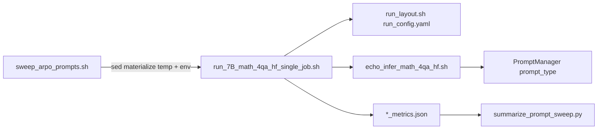

# Session system prompt

1. Read this entire `Project_plan.md` before doing any work.
2. Work on **exactly one** subtask: the first todo with `status: pending`, or the id the user names.
3. **Active subtask right now:** none (Goal S1–S3 complete)
4. Do not reopen Locked decisions unless the user explicitly asks.
5. Stay inside the active subtask’s deep brief. Put blockers and follow-ups in the Progress log.
6. Before editing, open the files named in that subtask’s deep brief and understand the current call graph.
7. Before ending the chat: mark the subtask completed or blocked; append a Progress log entry; end with `subtask_id | done|blocked | next_pending_id`.
8. Do not create alternate plan files (`Project_plan_v2.md`, dated copies, chat-named plans). This file is authoritative.
9. **Never edit** [`evaluation/run_7B_math_4qa_hf_single_job.sh`](evaluation/run_7B_math_4qa_hf_single_job.sh) for this goal; override via [`evaluation/sweep_arpo_prompts.sh`](evaluation/sweep_arpo_prompts.sh) only.

# Goal

Compare ARPO system prompts (not ECHO) on math_all for Hub `dongguanting/Qwen2.5-7B-ARPO` by running the existing 7B single-job driver through a standalone sweep wrapper, then summarizing which `prompt_type` wins.

# Architecture / codebase map



Key paths:
- [`evaluation/run_7B_math_4qa_hf_single_job.sh`](evaluation/run_7B_math_4qa_hf_single_job.sh) — **unchanged** on-disk driver
- [`evaluation/sweep_arpo_prompts.sh`](evaluation/sweep_arpo_prompts.sh) — materialize temp job + prompt loop
- [`evaluation/src/prompt_manager.py`](evaluation/src/prompt_manager.py) — ARPO prompt texts (`base`/`math`/`search`/`code_search`/`gemini`/`react`)
- [`evaluation/summarize_prompt_sweep.py`](evaluation/summarize_prompt_sweep.py) — rank by mean accuracy

# Subtasks

## S1 — No edits to run_7B; overrides via materialize
- Goal: Hub ARPO + overridable `PROMPT_TYPE` / `MAX_*` without touching the shared job file.
- Mechanism: `sed` rewrites only a **temp copy** so env vars win.
- Done when: on-disk `run_7B_...sh` git-clean from this goal; sweep still loads Hub ARPO.

## S2 — Prompt sweep
- Goal: sequential full evals for `base math search code_search gemini react`.
- Budgets: base 0/0, math 3/0, search 0/3, code_search 3/3, gemini 3/3, react 0/10.
- Done when: `./sweep_arpo_prompts.sh` runs without editing the driver.

## S3 — Summary table
- Goal: print ranked table mean + per math_all dataset; optional JSON/CSV.
- Filter: model needles contain `Qwen2.5-7B-ARPO`; prompt_type in sweep set.
- Done when: `python summarize_prompt_sweep.py` shows a best `prompt_type`.

# Locked decisions
- Do not permanently edit `run_7B_math_4qa_hf_single_job.sh`.
- Sweep set: `base math search code_search gemini react` (no `echo`, no `code_search_cn`; `claude` == `gemini` text → skip claude).
- Default model: `dongguanting/Qwen2.5-7B-ARPO`.
- Metric: prefer `llm_equal`, fallback `math_equal`.
- Full job per prompt (reason → infer → judge); no multi-prompt server reuse.

# How to run

```bash
cd evaluation
./sweep_arpo_prompts.sh
# optional: PROMPT_TYPES="base math code_search" ./sweep_arpo_prompts.sh
# optional: JOB_SCRIPT=./run_7B_math_4qa_hf_single_job.sh ACTOR_MODEL_PATH=dongguanting/Qwen2.5-7B-ARPO ./sweep_arpo_prompts.sh

python summarize_prompt_sweep.py \
  --root outputs/hf_math_4qa \
  --out outputs/arpo_prompt_sweep_summary.json \
  --csv outputs/arpo_prompt_sweep_summary.csv
```

# Progress log

### 2026-08-09 — S1-driver-arpo-hub — completed
- Changes: restored/left `run_7B_math_4qa_hf_single_job.sh` unmodified; sweep materializes a temp job for Hub ARPO + env knobs.
- Follow-ups: none.
- Next: S2-prompt-sweep

### 2026-08-09 — S2-prompt-sweep — completed
- Changes: added `evaluation/sweep_arpo_prompts.sh` with six prompt types and per-prompt budgets.
- Follow-ups: none.
- Next: S3-prompt-summary

### 2026-08-09 — S3-prompt-summary — completed
- Changes: added `evaluation/summarize_prompt_sweep.py` ranking mean + per-dataset rates.
- Follow-ups: run the sweep on GPUs when free, then summarize.
- Next: none
