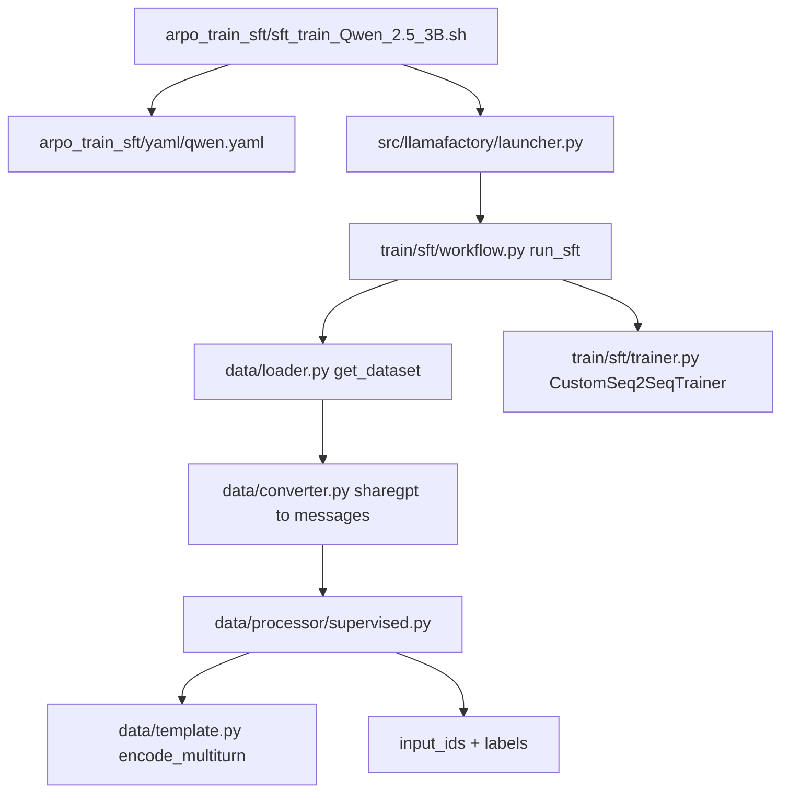

# ECHO SFT: mask tool output, lower LR, enable checkpoint selection

## Session system prompt

1. Read this whole file before touching code: Goal, architecture map, the active subtask's deep brief, locked decisions, Progress log.
2. Work on **exactly one** subtask per chat: the first `pending` todo, or the id the user names.
3. Do not reopen locked decisions unless the user asks.
4. Stay inside the active subtask's brief. Blockers and follow-ups go in the Progress log, not into silent scope creep.
5. Before ending: mark the subtask `completed` or `blocked`, append a Progress log entry, and end with `subtask_id | done|blocked | next_pending_id`.

**Active subtask right now:** none — S1, S2 and S3 are complete. The next chat should either add a new subtask (same deep-brief shape) or act on the follow-ups in the Progress log.

## Goal

Improve ECHO cold-start SFT without degrading CoT reasoning, following Lin et al., *SFT Doesn't Always Hurt General Capabilities* (arXiv 2509.20758). Three changes, all inside `LLaMA-Factory/`: stop training the model to memorize retrieved `<result>` text, drop the learning rate from `7e-6` to `1e-6`, and save enough checkpoints that the best one can actually be selected. The paper's core finding is that domain SFT at a small learning rate retains general capability (their general metric averages IFEval, GSM8K and HumanEval, so GSM8K *is* the CoT reasoning we care about preserving) while reaching comparable domain accuracy. Their Theorem B.3 makes the safe step size shrink as the number of low-probability "hard" tokens per example grows, which is why long CoT + tool traces need a smaller learning rate than label-only data, not a larger one.

## Architecture / codebase map

ECHO has two training stages living in different trees:

| Stage | Location | Role |
| --- | --- | --- |
| Cold-start SFT | `LLaMA-Factory/arpo_train_sft/` | Produces the checkpoint that RL initializes from. **This campaign touches only this stage.** |
| RL (GRPO) | `ECHO/training/` + `ARPO/verl_arpo_entropy/` | Consumes the SFT checkpoint via the `sft_root` launch key. Read-only reference here. |

SFT call graph:



Key facts established by inspection:

- **Dataset.** `arpo_train_sft/dataset/echo_sft_new.jsonl`, registered as `echo_dataset` in `arpo_train_sft/dataset_info/dataset_info.json`. 54,305 examples, every one exactly one `human` turn plus one `gpt` turn. The `gpt` turn is a single string interleaving `<think>`, `<tool>`, `<search>`/`<python>`, `<result>` and `<answer>`. Measured over the first 3,000 examples: 4,815 `<result>` blocks, **52.6% of assistant characters**.
- **Template.** `template: qwen` registers with the base `Template` class (no `template_class=`), `format_assistant = StringFormatter(["{{content}}<|im_end|>\n"])` at `src/llamafactory/data/template.py:1657`. So the assistant target is exactly `tokenizer.encode(content + "<|im_end|>\n", add_special_tokens=False)`, and character offsets computed on `content` alone align 1:1 with the leading tokens of `target_ids`.
- **Why not the `observation` role.** LLaMA-Factory already loss-masks `observation` turns (they land in `odd_tags` and get `IGNORE_INDEX`), but the qwen template renders them as `<|im_start|>user\n<tool_response>\n...` (`template.py:1662`), a different surface form from ECHO's inline single-turn traces. Using it would desync SFT from the RL rollout format.
- **RL parity.** `ARPO/verl_arpo_entropy/verl/workers/rollout/vllm_rollout/vllm_rollout_echo.py:362-365` appends `" <result>\n{result_text}\n</result>"` and sets `result_masks[idx].extend([0] * len(result_tokens))` — the whole span **including both tags** is excluded from the RL loss. Model-generated tokens get mask 1, and generation stops at `</search>`/`</python>`, so the closing tool tag is supervised. SFT masking must match: tags inclusive.
- **Batch math.** `per_device_train_batch_size: 1` x `gradient_accumulation_steps: 2` x 8 GPUs = 16 sequences per optimizer step. 54,305 / 16 ≈ 3,394 steps per epoch, so 3 epochs ≈ 10.2k steps.
- **Checkpoint size.** The existing 3B output dir is 47 GB: ~6 GB of model shards plus a ~41 GB ZeRO-3 `checkpoint-10185` folder that is almost entirely optimizer state. `/scratch` has 3.2 TB free. `transformers` is pinned to `>=4.49.0,<=4.52.4`, so `save_only_model` is available.

## Subtasks (deep briefs)

### S1 — Create the root plan file — completed

Create `project-plan-2026-09-02-0012.md` at the repo root per `.cursor/rules/plan-session-protocol.mdc`. `Project_plan.md` is left alone; it is already a stub pointing at an unrelated Goal.

### S2 — Loss-side masking of `<result>` spans

**Goal and why.** Half the supervised token budget is spent teaching the model to reproduce search snippets and Python stdout verbatim. Those tokens are irreducible noise: unpredictable proper nouns, numbers and formatting that generate large gradients every step and never become learnable. In the paper's decomposition \(k_1 = \Theta(w_S M_h + M_e)\), they dominate \(M_h\), the term that drives general-capability loss. Unlike MedCalc's hard tokens (which encode real domain knowledge and do get absorbed — their Figure 8), these should simply be removed from the loss. Doing so also makes SFT agree with RL about what the policy is responsible for generating.

**Files to read first.**

- `src/llamafactory/data/processor/supervised.py` — `_encode_data_example`, specifically `target_label = target_ids` at line 73.
- `src/llamafactory/data/processor/processor_utils.py` — `DatasetProcessor` is a 4-field `@dataclass` ABC (`template`, `tokenizer`, `processor`, `data_args`).
- `src/llamafactory/hparams/data_args.py` — `DataArguments`, especially `mask_history` and the `split_arg` helper in `__post_init__`.
- `src/llamafactory/data/template.py:1657-1669` — the qwen registration.

**Do.**

1. `data_args.py`: add a field next to `mask_history`:

```python
mask_tool_output_tags: Optional[str] = field(
    default=None,
    metadata={"help": "Comma-separated tag names whose spans are excluded from the loss, e.g. `result`."},
)
```

and `self.mask_tool_output_tags = split_arg(self.mask_tool_output_tags)` in `__post_init__`.

2. `supervised.py`: add `__post_init__` on `SupervisedDatasetProcessor` compiling the pattern once, plus the masking helper:

```python
def __post_init__(self):
    tags = self.data_args.mask_tool_output_tags
    self.tool_output_pattern = (
        re.compile("|".join(rf"<{t}>.*?</{t}>" for t in tags), re.DOTALL) if tags else None
    )

def _mask_tool_outputs(self, content: str, target_ids: list[int]) -> list[int]:
    spans = [m.span() for m in self.tool_output_pattern.finditer(content)]
    if not spans:
        return target_ids
    offsets = self.tokenizer(content, add_special_tokens=False, return_offsets_mapping=True)["offset_mapping"]
    labels = list(target_ids)
    for i in range(min(len(offsets), len(labels))):
        start, end = offsets[i]
        if any(start < s_end and end > s_start for s_start, s_end in spans):
            labels[i] = IGNORE_INDEX
    return labels
```

3. In `_encode_data_example`, capture the assistant strings alongside `encoded_pairs` and reverse both together under `mask_history`, then replace `target_label = target_ids` with a call to `_mask_tool_outputs`.

**Do not.**

- Do not rewrite the dataset or switch to the `observation` role; the tokenized sequence must stay byte-identical to what the RL rollout produces.
- Do not hardcode `result`; the tag list comes from config so the change is ablatable and defaults to off for every other LLaMA-Factory user.
- Do not touch `PackedSupervisedDatasetProcessor`; it inherits `_encode_data_example` and is covered for free.

**Done when.** With `mask_tool_output_tags: result`, the `labels:` line printed by `print_data_example` still shows `<think>`, `<tool>`, `<search>`, `<python>` and `<answer>` content but the `<result>` bodies are gone, and the masked share of supervised tokens lands near the 52.6% character measurement.

**Dependencies.** None beyond S1.

### S3 — `yaml/qwen.yaml`: learning rate and checkpoint selection

**Goal and why.** `7e-6` is 7x the paper's recommended `1e-6` and above the `5e-6` at which they measured Qwen2.5-3B's general average collapsing from 0.6202 to 0.3337 for a domain gain of only 0.4947 to 0.5459. Separately, `save_total_limit: 1` with no eval set makes the paper's own protocol — select the best domain checkpoint, then measure general capability — impossible to run.

**Files to read first.** `arpo_train_sft/yaml/qwen.yaml`, and `arpo_train_sft/sft_train_Qwen_2.5_7B.sh` (the only script that currently overrides the learning rate).

**Do.**

- `learning_rate: 7.0e-6` becomes `1.0e-6`.
- Keep `num_train_epochs: 3.0`. At 16 sequences per step that is ~10.2k steps, the same regime where the paper's Figure 7 shows domain accuracy still climbing at `1e-6`. Whether to extend is decided after the first run from the checkpoint sweep, not guessed now.
- Add `mask_tool_output_tags: result` to the dataset block.
- `save_steps: 2000` becomes `1000`; `save_total_limit: 1` becomes `12`; add `save_only_model: true`. Ten intermediate checkpoints plus the final at ~6 GB each is ~66 GB for 3B against 3.2 TB free.
- Add `val_size: 0.01`, `eval_strategy: steps`, `eval_steps: 1000`, `per_device_eval_batch_size: 1`. ~543 held-out examples give a validation-loss curve for spotting overfit.
- Drop the now-redundant `learning_rate=1.0e-6` override in `sft_train_Qwen_2.5_7B.sh`.

**Do not.**

- Do not set `load_best_model_at_end`; it would silently select by validation loss, whereas the real criterion is downstream agentic accuracy measured externally per checkpoint.
- Do not turn off `overwrite_cache`; a stale cache would serve pre-masking labels.
- Do not add `weight_decay` or a KL penalty. Their L2-reg baseline gained ~0.005 and KL regularization at coefficient 0.001 was indistinguishable from plain SFT at every learning rate (their Figure 5).

**Done when.** A short run (`max_samples=64`) writes checkpoints containing only weights, logs an `eval_loss`, and the resolved config shows `learning_rate=1e-06`.

**Dependencies.** S2, since `mask_tool_output_tags` must exist as a `DataArguments` field before the yaml can set it.

## Locked decisions

- Loss-side masking, not data-side. The tokenized sequence stays byte-identical to what ECHO RL rolls out.
- Masking is config-driven via `mask_tool_output_tags`, defaulting to `None` (off).
- `<result>` spans are masked **inclusive of both tags**, matching `vllm_rollout_echo.py`.
- Model-only checkpoints. Mid-run crash resume loses optimizer state; accepted, since every consumer of these checkpoints (eval harness, RL init) needs weights only.
- Edit `qwen.yaml` in place rather than forking an `echo.yaml`; it is already ECHO-specific and all five model scripts point at it.
- All changes live in `LLaMA-Factory/`. `ECHO/`, `ARPO/`, `AEPO/`, `Tree-GRPO/` and `HiPER-agent/` are untouched.

## Deliberately out of scope

Noted for later, not addressed by this Goal:

- The Qwen3 scripts pass `template: qwen` rather than `qwen3` (the latter uses `ReasoningTemplate`).
- The RL rollout formats results as `" <result>\n...\n</result>"` while the SFT data uses bare inline `<result>...</result>` — a minor pre-existing surface mismatch.
- TALR (the paper's token-adaptive loss reweighting). Their Table 1 shows it roughly ties plain SFT once the learning rate is already `1e-6`; it earns its keep only at `5e-6` and above.
- Effective batch size stays 16. Raising it is a knob for later if gradient noise looks like a problem at the lower learning rate.

## Progress log

Template: `### YYYY-MM-DD — <subtask-id> — completed|blocked` with Changes / Follow-ups / Next.

### 2026-09-02 — S1-plan-file — completed

Changes: created this file at the repo root with frontmatter todos, session system prompt, Goal, architecture map, deep briefs for S2 and S3, locked decisions and this log.

Follow-ups: none.

Next: `S2-result-mask`.

### 2026-09-02 — S2-result-mask — completed

Changes:

- `src/llamafactory/hparams/data_args.py`: added `mask_tool_output_tags` (default `None`) and ran it through `split_arg` in `__post_init__`.
- `src/llamafactory/data/processor/supervised.py`: added `__post_init__` compiling `tool_output_pattern` once, `_mask_tool_outputs()`, capture of `target_contents` alongside `encoded_pairs` (reversed together under `mask_history`), and an `elif` branch replacing `target_label = target_ids`.

**Correction to the brief.** The brief's overlap test (`start < span_end and end > span_start`) over-masks. Qwen BPE merges `>` and `<` across the span boundary into a single `><` token, so any partially-overlapping token also carries the adjacent tool tag. Verification showed `</search>` losing its closing `>` and `<think>` losing its `<`. Since `</search>` is the rollout stop sequence, that would have stopped the model learning to close the tag. Fixed to full containment (`start >= span_start and end <= span_end`), which leaves the two boundary tokens supervised — visible as a stray `<>` where each result block was removed. This is the correct trade: the model must emit `</search>` exactly, and the extra `<` is truncated at the stop-string match during rollout.

Verified on 200 real examples with the actual tokenizer, template and processor:

- `input_ids` byte-identical with and without masking, so RL/SFT token parity holds.
- Supervised tokens 189,059 -> 66,624, i.e. **64.8% dropped** (higher than the 52.6% character estimate because retrieved snippets tokenize worse than fluent prose).
- Zero closing tool tags lost across `search`, `python`, `think`, `tool`, `answer`.
- Zero surviving `<result>` bodies; the single heuristic flag was a false positive where the model quotes the retrieved fact inside its own `<think>`.

Follow-ups: none blocking.

Next: `S3-sft-config`.

### 2026-09-02 — S3-sft-config — completed

Changes to `arpo_train_sft/yaml/qwen.yaml`: `learning_rate` 7.0e-6 -> 1.0e-6; added `mask_tool_output_tags: result` and `val_size: 0.01`; `save_steps` 2000 -> 1000, `save_total_limit` 1 -> 12, added `save_only_model: true`; replaced the commented-out eval block with `per_device_eval_batch_size: 1`, `eval_strategy: steps`, `eval_steps: 1000`. `num_train_epochs` left at 3.0. Removed the redundant `learning_rate=1.0e-6` override from `sft_train_Qwen_2.5_7B.sh` (its `num_train_epochs=1.0` override stays).

Verified by resolving the yaml through `get_train_args`: `learning_rate=1e-06`, `save_only_model=True`, `save_total_limit=12`, `eval_strategy=steps`, `load_best_model_at_end=False`, `mask_tool_output_tags=['result']`.

Follow-ups:

1. **Stale-checkpoint footgun before the first launch.** Every `sft_train_*.sh` sets `resume_from_checkpoint=true` when `${OUTPUT_DIR}/checkpoint-*` exists. `.../ECHO/sft/checkpoints/Qwen2.5-3B-Instruct/` still holds `checkpoint-10185` from the old 7e-6 run, and the new recipe totals ~10,182 steps, so a relaunch would "resume" past the end and train nothing. Point `CHECKPOINT_DIR` at a fresh subdir (or move the old run aside) before launching. Not done here — no deletions without explicit approval.
2. With `save_only_model: true`, a genuine mid-run resume reloads weights without optimizer state. Accepted per locked decisions.
3. After the first run, use the checkpoint sweep to decide whether 3 epochs is short of the domain peak; the paper's Figure 7 shows late peaks at `1e-6`.
4. Masking cuts supervised tokens by ~65%, so training-loss values are not comparable to any pre-change run. Compare curves only against runs made after this change.

Next: none pending.
