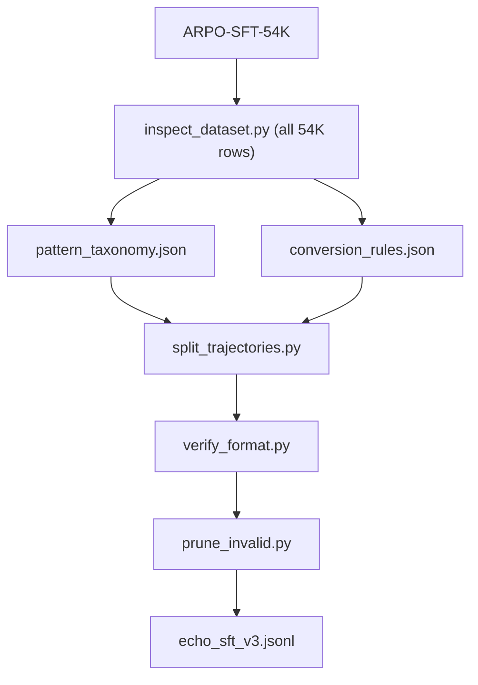

# SFT Trajectory Refactor Plan

Handoff document for implementing the ECHO SFT trajectory refactor in `scripts/sft_refactor/`.

**Do NOT modify** legacy scripts under `scripts/` (`add_select_rationales.py`, `preprocess_arpo_sft_trajectories.py`, `verify_*`, `prune_*`).

## Goal

Transform [`dongguanting/ARPO-SFT-54K`](https://huggingface.co/datasets/dongguanting/ARPO-SFT-54K) (~54.6K ShareGPT rows) from combined `<think>` blocks into a simpler schema:

```
<think> ... pure step reasoning ... </think>
<tool> ... why this tool is needed now ... </tool>
<search|python> ... </search|python>
<result> ... </result>
... repeat ...
<think> ... final reasoning ... </think>
<tool> ... why no further tool is needed ... </tool>   # before answer when applicable
<answer> ... \boxed{...} ... </answer>
```

- `<tool>` is free-text only (no tool name / quoted identifiers)
- No `<select>` blocks, no planning phase
- GPT splits mixed reasoning inside `<think>` into think + tool rationale

## Pipeline



## Inspect results (full dataset, 54,574 rows)

| Metric | Value |
|--------|-------|
| Unique patterns | 560 |
| `gpt_split` | 50,913 (93.3%) |
| `pass_through` | 3,138 (5.8%) — mostly `think→answer` |
| `drop` | 523 (1.0%) |

Top patterns:
- `think→python→result→answer` — 39.2%
- `think→python→result→think→answer` — 19.1%
- `think→search→result→think→search→result→think→answer` — 8.5%
- `think→search→result→think→answer` — 7.6%
- `think→answer` — 5.8%

Outputs written to `scripts/sft_refactor/output/inspect/`.

## Pilot (20 rows, heuristic split)

```bash
python scripts/sft_refactor/split_trajectories.py \
  --inspect-dir scripts/sft_refactor/output/inspect \
  --output scripts/sft_refactor/output/echo_sft_v3_pilot.parquet \
  --jsonl scripts/sft_refactor/output/echo_sft_v3_pilot.jsonl \
  --limit 20 --heuristic-only --fresh
```

Result: 19 kept, 1 dropped, 19/19 passed `verify_format.py`.

## Full run

```bash
# Use arpo conda env (has openai) or pip install openai in arpo-sft
conda activate arpo
export OPENAI_API_KEY="sk-..."

python scripts/sft_refactor/split_trajectories.py \
  --inspect-dir scripts/sft_refactor/output/inspect \
  --output scripts/sft_refactor/output/echo_sft_v3.parquet \
  --jsonl scripts/sft_refactor/output/echo_sft_v3.jsonl \
  --concurrency 50 --fresh

python scripts/sft_refactor/verify_format.py scripts/sft_refactor/output/echo_sft_v3.jsonl
python scripts/sft_refactor/prune_invalid.py scripts/sft_refactor/output/echo_sft_v3.jsonl \
  -o scripts/sft_refactor/output/echo_sft_v3_clean.jsonl
```

Use `--heuristic-only` to test pipeline without API (last-sentence split fallback).

## Files

| File | Purpose |
|------|---------|
| `constants.py` | `NEW_SYSTEM_PROMPT`, tag regexes, GPT system string |
| `trajectory_parse.py` | Segment parser |
| `inspect_dataset.py` | Full-dataset pattern scan |
| `split_trajectories.py` | Async GPT pipeline |
| `verify_format.py` | Structural validation |
| `prune_invalid.py` | Filter failing rows |

## Inspect outputs (`--output-dir`)

| Output | Description |
|--------|-------------|
| `inspect_report.json` | Summary stats |
| `pattern_taxonomy.json` | pattern_id → count, indices, rule |
| `conversion_rules.json` | pattern_id → action config |
| `inspect_index.jsonl` | One record per row |
| `samples/` | Exemplars per pattern |

## System prompt (new chat session)

```
You are implementing the ECHO SFT trajectory refactor in scripts/sft_refactor/.
Do NOT modify legacy scripts under scripts/ (add_select_rationales.py, preprocess_arpo_sft_trajectories.py, verify_*, prune_*).

Goal: transform dongguanting/ARPO-SFT-54K into a simplified agentic SFT format.

Target assistant trajectory schema:
- Reasoning lives in <think>...</think>.
- When a tool call follows, insert <tool>...</tool> immediately before it with a short free-text rationale for why search or python is needed at that step. Do NOT put tool names or quoted identifiers inside <tool>.
- Tool calls and results stay as in ARPO: <search>...</search><result>...</result>, <python>...</python><result>...</result>.
- Before the final <answer>, optionally insert <tool>...</tool> explaining why no further tool is needed (only when the source think block mixed that rationale with step reasoning).
- Final answer in <answer> with \boxed{} LaTeX.
- No <select> blocks. No planning phase. No <tool_rationale> or <no_tool_needed /> markers.

Original data problem: each <think> block often combines general reasoning AND tool-choice language. Use GPT to split into thinking vs tool_rationale, then reassemble.

Pipeline files (all under scripts/sft_refactor/):
- constants.py, trajectory_parse.py, inspect_dataset.py, split_trajectories.py, verify_format.py, prune_invalid.py

Start by running inspect_dataset.py on ALL rows of ARPO-SFT-54K (~54K). Do not begin split_trajectories.py until pattern_taxonomy.json and conversion_rules.json are complete and reviewed.
```

## User-facing SFT system prompt (`constants.NEW_SYSTEM_PROMPT)

```
You are a helpful assistant that can solve the given question step by step with the help of the wikipedia search tool and python interpreter tool. Given a question, first reason in <think>...</think>. If you need a tool, write a brief tool-selection rationale in <tool>...</tool> immediately before the tool call. Search queries go in <search>...</search>, code in <python>...</python>, and outputs in <result>...</result>. You may repeat think → tool → call → result cycles. When ready to finish, reason in <think>...</think>, optionally explain in <tool>...</tool> why no further tool is needed, then give the final answer in <answer>...</answer> with the exact answer in \boxed{} LaTeX format.
```

## Open items

- RL reward in `deep_research_echo.py` still expects `<select>` — separate update if RL uses this schema
- Register `echo_sft_v3` in `LLaMA-Factory/arpo_train_sft/dataset_info/dataset_info.json` after validation
