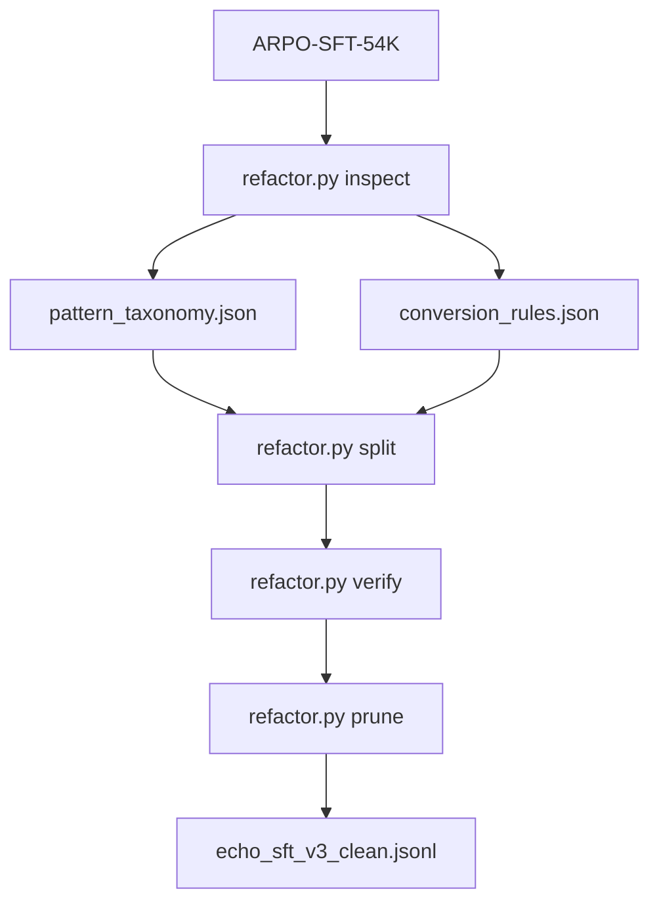

# SFT Trajectory Refactor Plan

Handoff document for the ECHO SFT trajectory refactor in `scripts/sft_refactor/`.

**Do NOT modify** legacy scripts under `scripts/` (`add_select_rationales.py`, `preprocess_arpo_sft_trajectories.py`, `verify_*`, `prune_*`). All work stays inside `scripts/sft_refactor/`.

## Goal

Transform [`dongguanting/ARPO-SFT-54K`](https://huggingface.co/datasets/dongguanting/ARPO-SFT-54K) (~54.6K ShareGPT rows) so that reasoning and tool-selection rationale are cleanly separated, and **every** action is justified.

### Target schema

```
<think> general problem-solving reasoning </think>
<tool> why THIS specific tool call is made </tool>
<search|python> ... </search|python>
<result> ... </result>
<tool> why THIS next tool call is made (distinct reasoning) </tool>
<search|python> ... </search|python>
<result> ... </result>
...
<tool> why no further tool is needed / ready to answer </tool>
<answer> ... \boxed{...} ... </answer>
```

- `<tool>` is **mandatory** and precedes every tool call (`search`/`python`) and the final `<answer>`.
- A single `<think>` may be followed by multiple tool calls; **each** call gets its own distinct `<tool>` rationale.
- `<tool>` is free-text only (no tool name / quoted identifiers).
- No `<select>` blocks, no planning phase.

### Distinct jobs of `<think>` vs `<tool>`

- `<think>`: general problem solving — decomposing the question, interpreting results, deciding direction. No "I will search / run code" language.
- `<tool>`: why THIS specific action is taken now. For the pre-answer `<tool>`, it explains why no further tool is needed and the model can answer directly.

### Structural invariants (enforced by verify)

1. First tag is `think`.
2. Each `think` is immediately followed by `tool`.
3. Each `tool` is immediately followed by `search` / `python` / `answer`.
4. Each `search` / `python` is immediately preceded by `tool` and immediately followed by `result`.
5. Exactly one `answer`, immediately preceded by `tool`, containing `\boxed{}`.
6. No stray text, no disallowed tags.

## File layout (consolidated: 6 → 3 files)

| File | Role |
|------|------|
| `constants.py` | `NEW_SYSTEM_PROMPT`, `GPT_SYSTEM`, `GPT_REVIEW_SYSTEM`, tag lists/aliases |
| `trajectory.py` | Auxiliary utilities: segment parsing, think-merging, action extraction, reassembly, structural flags, `verify_text` |
| `refactor.py` | Main CLI with subcommands `inspect` / `split` / `verify` / `prune` |

`trajectory.py` absorbs today's `trajectory_parse.py` plus the validation logic from `verify_format.py`. `refactor.py` absorbs `inspect_dataset.py` + `split_trajectories.py` + `prune_invalid.py` as subcommands sharing one dataset loader and arg group. `inspect_dataset.py`, `split_trajectories.py`, `verify_format.py`, `prune_invalid.py`, `trajectory_parse.py` are removed (their logic migrates).



## `trajectory.py` (utilities)

Migrated from `trajectory_parse.py`, kept as-is unless noted:
- `parse_segments`, `tag_sequence`, `pattern_id_from_segments`, `count_tags`, `think_follows`, `structural_flags`, `extract_assistant` — unchanged.

New / changed:
- `merge_consecutive_thinks(segments)` — collapse adjacent `think` segments (concatenate content) so every `think` precedes an action. Handles ~800 `think→think` rows (e.g. `think→search→result→think→think→answer`).
- `action_units(segments)` — replaces `split_units`. Returns ordered actions (`search`/`python`/`answer`), each with `kind`, truncated `content`, and nearest preceding `think` content (context for the rationale). Also returns the post-merge think count.
- `reassemble(segments, clean_thinks, tool_rationales)` — replaces `reassemble_after_split`. Walks merged segments; emits `<think>` from `clean_thinks[]` in order and a `<tool>` (from `tool_rationales[]`, in action order) immediately before every `search`/`python`/`answer`.
- `verify_text(text)` — moved from `verify_format.py`; rules updated to the invariants above (each `think`→`tool`; each `tool`→call/answer; each call preceded by `tool` and followed by `result`; `answer` preceded by `tool`).

## `refactor.py` (main logic)

Argparse subcommands over a shared dataset loader:

### `inspect`
Full-dataset pattern scan (from `inspect_dataset.py`). Writes `inspect_report.json`, `pattern_taxonomy.json`, `conversion_rules.json`, `inspect_index.jsonl`, `samples/`.
- `infer_conversion_rule` simplified: keep `drop` (malformed: unpaired tags, first-tag-not-think, tool-before-think, multiple/absent answer, empty); **all other rows → `gpt_split`**. `pass_through` removed (even `think→answer` now needs a `<tool>` before the answer). Rule keeps only `action` and `strip_stray`.

### `split`
Async GPT think/tool split (from `split_trajectories.py`). Two GPT passes per row:
1. **Breakdown pass** (`GPT_SYSTEM`): `merge_consecutive_thinks` → `action_units` → GPT returns cleaned/enriched thinks + per-action rationales → `reassemble`.
2. **Coherence pass** (`GPT_REVIEW_SYSTEM`): GPT reads the fully assembled `<think>/<tool>/call/<result>/…/<answer>` trajectory and verifies it reads as one coherent reasoning process (not stitched blocks). It returns either an OK signal or revised `thinks[]`/`tools[]` (same counts), which are re-`reassemble`d.
- Drop rows follow the `drop` rule; every non-drop row goes through GPT (no `pass_through` branch).
- Checkpointing (`.ckpt.jsonl`), `--concurrency`, `--limit`, `--fresh`, `--heuristic-only` retained. Coherence pass toggled by `--coherence-review/--no-coherence-review` (default on; disabled automatically under `--heuristic-only`).

### `verify`
Runs `verify_text` over a JSONL, prints OK/bad counts + reason histogram.

### `prune`
Drops rows failing `verify_text`, writes clean JSONL/parquet.

## GPT contract

`GPT_SYSTEM` instructs: **reorganize and enrich the existing trajectory** into general thinking vs per-action tool rationale. GPT is an editor/enhancer, not a solver.

### Grounding constraint (do NOT re-solve the problem)

GPT reorganizes and enriches the trajectory using the existing reasoning as in-context grounding — it does not produce an independent solution:

- Never change or regenerate the `<answer>`, the search queries, the python code, or the tool results — those are copied verbatim during reassembly (GPT only sees them as read-only context).
- `thinks[i]` may **enhance** the source think content (clarify, expand, strip tool-selection phrasing) and can be rich, as long as it stays consistent with the source reasoning and the actual trajectory. It is not restricted to a verbatim cleanup.
- Each `tools[i]` rationale may likewise be rich and well-argued, grounded in what the trajectory does at that step (the upcoming query/code, prior results, the source think's intent).
- The existing reasoning blocks are treated as in-context information, not a hard template — GPT may reshape them for clarity and quality.
- The constraint is **loose**: when a step has little or no source reasoning to draw on (e.g. a bare tool call with no preceding think, or a `think→answer` row), GPT may still write a plausible, grounded rationale. The only hard limit is not altering answers/queries/code/results and not fabricating a different solution path.

Prompt (`build_split_prompt`) provides the question, the ordered think blocks, and the ordered actions (kind + truncated query/code, or the answer). Returns strict JSON:

```json
{"thinks": ["cleaned think 1", "..."], "tools": ["why action 1", "why action 2", "...", "why no more tools (before answer)"]}
```

- `len(thinks)` = post-merge think count; `len(tools)` = number of actions (tool calls + 1 answer).
- Each `tools[i]` is specific to that action (can be rich); the answer's rationale explains why no further tool is needed.
- `thinks[i]` contains general reasoning only (tool-selection language moved to `<tool>`), and may enhance/expand the source meaning.

### Coherence review pass

After the breakdown is reassembled, a second GPT call (`GPT_REVIEW_SYSTEM`, `build_review_prompt`) audits the whole trajectory for reasoning coherence — not just structural validity:

- The `<think>` blocks form a logical progression; each `<tool>` genuinely motivates its call and the calls make sense in sequence; the pre-answer `<tool>` truly follows from the accumulated results; nothing reads as disconnected boilerplate.
- Consistency with the original SFT row (same problem, same solution path) and the same grounding constraint (never alter answers/queries/code/results, no re-solving).
- Returns strict JSON: `{"ok": true}` when the trajectory is coherent, otherwise `{"thinks": [...], "tools": [...]}` with the same counts, carrying minimal revisions to restore coherence. Revised output is re-`reassemble`d and must still pass `verify_text`.

Heuristic fallback (`--heuristic-only`, no API): keep thinks as-is; for each action emit a generic rationale (last sentence of the nearest preceding think for the first action after a think, a brief default otherwise); coherence pass is skipped. For pipeline testing only.

## Inspect results (full dataset, 54,574 rows)

| Metric | Value |
|--------|-------|
| Unique patterns | 560 |
| `gpt_split` (post-refactor: all non-drop) | ~54,051 |
| `drop` | 523 (1.0%) |

Top patterns:
- `think→python→result→answer` — 39.2%
- `think→python→result→think→answer` — 19.1%
- `think→search→result→think→search→result→think→answer` — 8.5%
- `think→search→result→think→answer` — 7.6%
- `think→answer` — 5.8% (now gets a `<tool>` before the answer)
- multi-call-per-think patterns (e.g. `think→python→result→python→result→answer`) — each call gets its own `<tool>`
- `think→...→think→think→answer` (~800 rows) — consecutive thinks merged

## Commands

Pilot (heuristic, no API):

```bash
python scripts/sft_refactor/refactor.py inspect \
  --output-dir scripts/sft_refactor/output/inspect
python scripts/sft_refactor/refactor.py split \
  --inspect-dir scripts/sft_refactor/output/inspect \
  --output scripts/sft_refactor/output/echo_sft_v3_pilot.parquet \
  --jsonl scripts/sft_refactor/output/echo_sft_v3_pilot.jsonl \
  --limit 20 --heuristic-only --fresh
python scripts/sft_refactor/refactor.py verify \
  scripts/sft_refactor/output/echo_sft_v3_pilot.jsonl
```

Full run:

```bash
conda activate arpo
export OPENAI_API_KEY="sk-..."

python scripts/sft_refactor/refactor.py inspect \
  --output-dir scripts/sft_refactor/output/inspect
python scripts/sft_refactor/refactor.py split \
  --inspect-dir scripts/sft_refactor/output/inspect \
  --output scripts/sft_refactor/output/echo_sft_v3.parquet \
  --jsonl scripts/sft_refactor/output/echo_sft_v3.jsonl \
  --concurrency 50 --fresh
python scripts/sft_refactor/refactor.py verify \
  scripts/sft_refactor/output/echo_sft_v3.jsonl
python scripts/sft_refactor/refactor.py prune \
  scripts/sft_refactor/output/echo_sft_v3.jsonl \
  -o scripts/sft_refactor/output/echo_sft_v3_clean.jsonl
```

## User-facing SFT system prompt (`constants.NEW_SYSTEM_PROMPT`)

```
You are a helpful assistant that solves the given question step by step with a wikipedia search tool and a python interpreter tool. First reason about the problem in <think>...</think>. Before every tool call, write a brief rationale in <tool>...</tool> explaining why that specific call is needed. Put search queries in <search>...</search>, code in <python>...</python>, and tool outputs in <result>...</result>. You may make several tool calls; each one must be preceded by its own <tool> rationale. When ready to finish, write a final <tool>...</tool> explaining why no further tool is needed, then give the answer in <answer>...</answer> with the exact answer in \boxed{} LaTeX format.
```

## Migration steps

1. Create `trajectory.py`: move `trajectory_parse.py` content; add `merge_consecutive_thinks`, `action_units`, `reassemble`; move+update `verify_text`.
2. Create `refactor.py`: subcommands `inspect` / `split` / `verify` / `prune` reusing `trajectory.py`; simplify `infer_conversion_rule`; drop `pass_through` branch; add the two-pass split (breakdown + coherence review).
3. Update `constants.py`: `NEW_SYSTEM_PROMPT`, `GPT_SYSTEM`, `GPT_REVIEW_SYSTEM`.
4. Remove `inspect_dataset.py`, `split_trajectories.py`, `verify_format.py`, `prune_invalid.py`, `trajectory_parse.py` (logic migrated).
5. Re-run `inspect` (regenerates `conversion_rules.json`/taxonomy without `pass_through`).
6. Run heuristic pilot (20 rows) + `verify`; confirm all pass the new invariants.

## Open items

- RL reward in `deep_research_echo.py` still expects `<select>` — separate update if RL uses this schema.
- Register `echo_sft_v3` in `LLaMA-Factory/arpo_train_sft/dataset_info/dataset_info.json` after validation.
